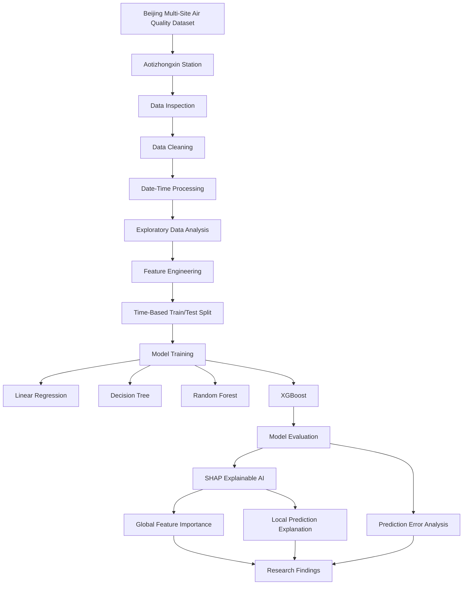

# AirSense-XAI

## Explainable Machine Learning for PM2.5 Concentration Prediction

AirSense-XAI is an explainable machine learning project for predicting hourly PM2.5 concentration using air-quality and meteorological observations from the Beijing Multi-Site Air Quality dataset.

The project compares multiple regression models and uses SHAP (SHapley Additive exPlanations) to explain the predictions of the selected XGBoost model.

> **Current scope:** The present implementation focuses on the Aotizhongxin monitoring station. Future work extends the framework to multiple stations and future PM2.5 forecasting.

---

## Project Objective

The objective of AirSense-XAI is to develop a machine learning framework that:

- predicts PM2.5 concentration from environmental observations;
- compares multiple regression algorithms;
- identifies important environmental predictors;
- explains model predictions using SHAP;
- analyzes prediction errors and limitations;
- provides a foundation for future multi-station and real-time air-quality research.

---

## Research Questions

1. Can machine learning models accurately predict PM2.5 concentration?
2. Which evaluated model provides the strongest predictive performance?
3. Which environmental variables have the greatest influence on PM2.5 predictions?
4. Can Explainable AI provide interpretable explanations of model predictions?
5. Where does the model experience greater prediction difficulty?

---

## Dataset

**Dataset:** Beijing Multi-Site Air Quality

**Source:** UCI Machine Learning Repository

**Dataset DOI:** 10.24432/C5RK5G

The dataset contains hourly air-pollution and meteorological observations from 12 monitoring sites in Beijing covering March 1, 2013 to February 28, 2017.

For the current experiment, the **Aotizhongxin** station is used.

### Main variables

- PM2.5
- PM10
- SO2
- NO2
- CO
- O3
- TEMP
- PRES
- DEWP
- RAIN
- WSPM
- year
- month
- day
- hour
- wind direction

The original dataset is not included in this repository. Users should obtain it from the official UCI source and place the required CSV in the appropriate local/Colab path.

---

## Project Workflow



---

## Models Evaluated

Four regression models were evaluated:

1. Linear Regression
2. Decision Tree Regressor
3. Random Forest Regressor
4. XGBoost Regressor

A chronological 80/20 train-test split was used to reduce temporal leakage from randomly shuffling the observations.

---

## Results

| Model | MAE | RMSE | R² |
|---|---:|---:|---:|
| Linear Regression | 17.443 | 25.264 | 0.9134 |
| Decision Tree | 16.009 | 28.658 | 0.8886 |
| Random Forest | 13.385 | 21.828 | 0.9354 |
| **XGBoost** | **12.937** | **21.331** | **0.9383** |

### Best model

XGBoost achieved the strongest overall performance:

- **MAE:** 12.94
- **RMSE:** 21.33
- **R²:** 0.9383

The R² score indicates that approximately 93.83% of the variation in the test-set PM2.5 observations is explained by the model under this experimental setup.

---

## Explainable AI — SHAP

SHAP was applied to the XGBoost model to understand which features most strongly influence its predictions.

### Global feature importance

The SHAP analysis identified the following leading features:

1. **PM10**
2. **CO**
3. **DEWP**
4. **TEMP**
5. **month**

PM10 was substantially more influential than the other variables in the current model.

The SHAP beeswarm analysis also showed that higher PM10 observations generally produced positive SHAP values, increasing the predicted PM2.5 output.

CO and DEWP were the next most influential variables.

> These are model-derived associations and should not be interpreted as proof of causal relationships.

---

## Prediction Error Analysis

The XGBoost error distribution is concentrated around zero, indicating that most predictions are relatively close to observed PM2.5 values.

The distribution also contains a positive right-skewed tail. This indicates that the model substantially underpredicts PM2.5 for a smaller number of high-pollution observations.

Extreme pollution episodes therefore remain an important area for future investigation.

---

## Limitations

- The current analysis focuses on one monitoring station: Aotizhongxin.
- PM10 is the dominant predictor, and its strong relationship with PM2.5 should be interpreted carefully.
- The current task predicts PM2.5 from measurements from the same observation period; it should not be described as future forecasting.
- Extreme pollution events are more difficult for the model to predict accurately.
- Broader generalization requires validation across additional stations and time periods.

---

## Future Work

### 1. Multi-station modelling
Extend the framework to all available Beijing monitoring stations.

### 2. Future PM2.5 forecasting
Introduce lagged variables to predict PM2.5 one hour, six hours, or 24 hours ahead.

### 3. Advanced time-series models
Evaluate LSTM, GRU, Temporal Convolutional Networks, and Transformer-based approaches.

### 4. Advanced Explainable AI
Compare SHAP with Partial Dependence, Accumulated Local Effects, and counterfactual explanations.

### 5. Extreme pollution analysis
Develop dedicated analysis for high-pollution episodes and model failure cases.

### 6. Real-time deployment
Develop a real-time prediction interface that combines PM2.5 estimates with human-interpretable explanations.

### 7. Cross-region validation
Evaluate transferability using air-quality data from other cities or regions.

---

## Repository Structure

```text
AirSense-XAI/
│
├── AirSense-XAI.ipynb
├── README.md
├── requirements.txt
├── .gitignore
│
├── images/
│   ├── pm25_distribution.png
│   ├── pm25_over_time.png
│   ├── model_comparison.png
│   ├── shap_summary.png
│   ├── shap_feature_importance.png
│   ├── shap_pm10_dependence.png
│   └── prediction_error_distribution.png
│
└── results/
    └── model_results.csv
```

The raw dataset should **not** be committed to the repository. Keep it local or download it from the official dataset source when running the notebook.

---

## Reproducibility

Install the required Python packages:

```bash
pip install -r requirements.txt
```

Then open:

```text
AirSense-XAI.ipynb
```

The notebook contains the complete workflow from data loading through model evaluation and SHAP analysis.

---

## Key Technologies

- Python
- Google Colab / Jupyter Notebook
- Pandas
- NumPy
- Matplotlib
- Seaborn
- Scikit-learn
- XGBoost
- SHAP
- Explainable AI
- Machine Learning
- Exploratory Data Analysis
- Time-Series Data Analysis

---

## Research Outcome

AirSense-XAI demonstrates how predictive machine learning can be combined with Explainable AI to produce both accurate PM2.5 predictions and interpretable information about the factors influencing those predictions.

The current results provide a foundation for future work involving multi-station modelling, true future forecasting, extreme-event analysis, and real-time air-quality prediction.
